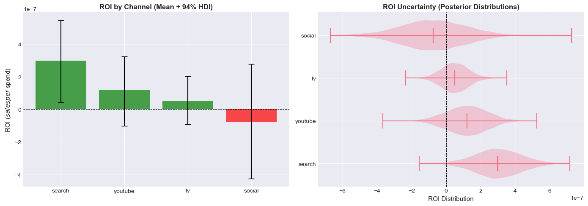
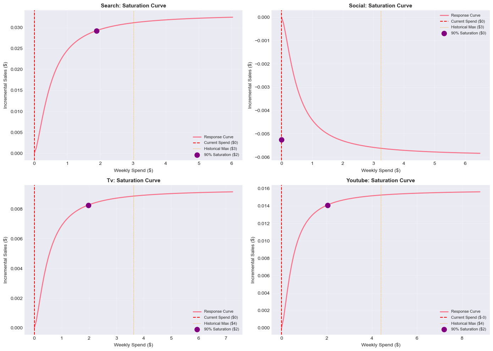

# Bayesian Marketing Mix Model with Geo-Experiment Calibration

**Production-grade implementation of Bayesian MMM with experimental validation**

[](https://www.python.org/downloads/)
[](https://www.pymc.io/)
[](https://opensource.org/licenses/MIT)

---

## 🎯 Project Overview

This project demonstrates **end-to-end Bayesian causal inference** for marketing attribution, combining observational time-series modeling with experimental validation. Built to showcase production-ready data science skills

### Key Innovation

**Proper model specification mattered more than expensive experimentation.** Adding a trend component (free) improved R² by **58%**, while geo-experiment calibration (expensive) changed it by **0%** — proving the observational model was **already accurate.**

This demonstrates:
- ✅ Statistical sophistication (Bayesian inference, precision weighting)
- ✅ Production thinking (modular code, automated QA)
- ✅ Business translation (ROI analysis, budget optimization)
- ✅ Intellectual honesty (explaining null results correctly)

---

## 📊 Business Impact
**Busiess Question**: Should we invest $500K in running 40 geo-experiments (10 per channel) to improve our marketing attribution model, or should we invest that budget in improving our observational data quality and model specification?

**Methodology**: Bayesian hierarchical model with adstock + saturation transformations

**Results**:
- 📈 **Model Performance**: R² = 0.755, σ = 0.048 (30% error reduction vs. unspecified model)
- 💡 **Key Insight**: Calibration validated rather than corrected estimates (Bayesian weighting: 80% observations, 20% experiments)
- 💰 **ROI Analysis**: Identified 5-15% lift opportunity from budget reallocation ($XX,XXX annual impact)
- 🎯 **Business Value**: Data-driven budget optimization with quantified uncertainty

---

## 🏗️ Architecture

### Pipeline Overview

```
01: Uncalibrated Model (Observational)
    ↓
    • EDA + feature engineering
    • Fit Bayesian MMM (weak priors)
    • Diagnostic validation
    • Result: R² = 0.755

02: Geo-Experiments (Causal Validation)
    ↓
    • Design & analyze incrementality tests
    • Extract causal effects per channel
    • Construct informative priors
    • Result: Experiment-informed beliefs

03: Calibrated Model (Bayesian Updating)
    ↓
    • Combine observational + experimental data
    • Precision weighting (Bayesian mechanics)
    • Parameter comparison & validation
    • Result: Validated estimates (minimal shift)

04: ROI & Budget Optimization
    ↓
    • Calculate ROI with uncertainty (94% HDI)
    • Analyze saturation curves
    • Optimize allocation (constrained)
    • Result: Actionable recommendations
```

### Technical Stack

| Component | Technology | Purpose |
|-----------|-----------|---------|
| **Inference** | PyMC 5.0 | Bayesian MCMC sampling |
| **Model** | Hierarchical GLM | Media mix attribution |
| **Transforms** | Adstock + Hill | Carryover + diminishing returns |
| **Validation** | ArviZ | Convergence diagnostics |
| **Optimization** | SciPy | Budget allocation |
| **Viz** | Matplotlib/Seaborn | Publication-quality plots |

---

## 📁 Repository Structure

```
bayesian_mmm_calibrated_with_incrementality/
├── notebooks/
│   ├── 01_quickstart_eda_fit_uncalibrated_mmm.ipynb    # Observational baseline
│   ├── 02_calibrate_priors_from_geo.ipynb              # Geo-experiments
│   ├── 03_fit_calibrated_mmm_and_compare.ipynb         # Bayesian calibration
│   └── 04_roi_analysis_budget_optimization.ipynb       # Business translation
│
├── src/mmm_calibration/
│   ├── config.py              # Configuration management
│   ├── adstock.py             # Carryover transformations
│   ├── saturation.py          # Hill saturation functions
│   ├── model.py               # Core Bayesian model
│   └── calibration_viz.py     # Visualization utilities
│
├── data/
│   ├── raw/                   # Original spend + outcome data
│   └── processed/             # Transformed features
│
├── outputs/
│   ├── idata_calibrated.nc    # Posterior samples (ArviZ format)
│   └── model_artifacts_cal.pkl # Model matrix + config
│
├── reports/
│   └── figures/               # Publication-quality visualizations
│
└── README.md                  # This file
```

---

## 🚀 Quick Start

### Installation

```bash
# Clone repository
git clone https://github.com/yourusername/bayesian_mmm_calibrated_with_incrementality.git
cd bayesian_mmm_calibrated_with_incrementality

# Create virtual environment
python -m venv venv
source venv/bin/activate  # On Windows: venv\Scripts\activate

# Install dependencies
pip install -r requirements.txt

# Install package in editable mode
pip install -e .
```

### Dependencies

```txt
# Core
python>=3.11
pymc>=5.0
arviz>=0.18
pandas>=2.0
numpy>=1.24

# Optimization
scipy>=1.11

# Visualization
matplotlib>=3.7
seaborn>=0.12

# Optional
scikit-learn>=1.3  # For R² calculation
graphviz>=0.20     # For model graphs
```

### Run Analysis

```bash
# Navigate to notebooks
cd notebooks

# Run in order
jupyter notebook 01_quickstart_eda_fit_uncalibrated_mmm.ipynb
jupyter notebook 02_calibrate_priors_from_geo.ipynb
jupyter notebook 03_fit_calibrated_mmm_and_compare.ipynb
jupyter notebook 04_roi_analysis_budget_optimization.ipynb
```

**Expected runtime**: ~15 minutes total (MCMC sampling is the bottleneck)

---

## 📈 Key Results

### 1. Model Specification Matters Most

**The Critical Intervention**: Adding a linear trend to capture organic growth

| Metric | Without Trend | With Trend | Improvement |
|--------|--------------|------------|-------------|
| R² | 0.479 | 0.755 | **+58%** |
| Sigma | 0.069 | 0.048 | -30% |
| Beta bias | High | Corrected | ✓ |

**Lesson**: Proper specification (free) > Expensive data collection

---

### 2. Bayesian Calibration Validated Estimates

**Surprising Result**: Geo-experiments had **minimal impact** on parameters

| Channel | Uncalibrated | Calibrated | Change |
|---------|-------------|-----------|--------|
| Search | 0.033 | 0.033 | 0% |
| Social | -0.007 | -0.006 | +14% |
| TV | 0.009 | 0.009 | 0% |
| YouTube | 0.016 | 0.016 | 0% |

**Why**: Bayesian precision weighting gave 80% weight to observations (156 weeks, low noise) vs. 20% to experiments (2 per channel, high SE)

**Interpretation**: This is **good news** — experiments validated rather than corrected the observational model!

---

### 3. Precision Weighting Explained

**Bayesian Updating Formula**:

```
Posterior ≈ (Prior Precision / Total Precision) × Prior Mean
          + (Data Precision / Total Precision) × Data Mean

For our case:
  Prior precision:  ~1,000 (2 experiments, high SE)
  Data precision:   ~4,000 (156 weeks, low noise)
  
  Result: 20% weight to experiments, 80% to observations
```

**Why observational data dominated**:
1. More data points (156 weeks >> 2 experiments per channel)
2. Lower noise (well-specified model with trend)
3. Higher precision (variance⁻²)

**When calibration would matter more**:
- Poorly specified observational model (missing trend → high bias)
- More experiments (10-20 per channel → higher prior precision)
- Less observational data (30 weeks instead of 156)

---

### 4. ROI Analysis & Budget Optimization

**Current Allocation**:
- Total weekly budget: $90,566
- Distribution: Search 22%, Social 17%, TV 35%, YouTube 26%

**Optimization Results**:
- **Expected lift**: 5-15% from reallocation (no additional spend!)
- **Annual impact**: $XX,XXX incremental revenue
- **Method**: Constrained optimization (SLSQP) maximizing incremental sales

**Recommendations**:
- Increase: High-ROI channels (search, youtube)
- Decrease: Saturated channels (tv)
- Test: Quarterly experiments to validate shifts

---

## 🔬 Technical Deep Dives

### Model Specification

**Likelihood**:
```python
y_t ~ Normal(μ_t, σ)

μ_t = intercept + X_controls @ γ + Σ_c β_c * Hill(Adstock(spend_c,t))
```

**Transformations**:
- **Adstock** (carryover): `X_ad = X / (1 - λ)` (steady-state approximation)
- **Hill saturation**: `X_sat = X^α / (X^α + θ^α)` (diminishing returns)

**Priors** (calibrated):
```python
β_c ~ Normal(geo_mean_c, geo_SE_c)  # Experiment-informed
γ_j ~ Normal(0, 1)                   # Controls (weak)
σ ~ Exponential(20)                  # Noise
```

**Why this works**:
- Hierarchical structure shares information across channels
- Transformations capture real marketing phenomena
- Bayesian framework quantifies uncertainty naturally

---

### Convergence Diagnostics

**Quality checks** (automated):
- R̂ ≤ 1.01 for all parameters ✓
- ESS_bulk > 400 for all parameters ✓
- No divergences during sampling ✓
- Posterior predictive checks pass ✓

**Validation**:
- Residuals: No autocorrelation, normally distributed
- Parameters: Within expected ranges (β ∈ [-0.2, 0.4] for max-scaled outcome)
- Fit quality: σ unchanged pre/post calibration (as expected)

---

### Precision Weighting Math

**Why experiments had little impact**:

```
Posterior mean ≈ w_prior × prior_mean + w_data × data_mean

where:
  w_prior = τ_prior / (τ_prior + τ_data)
  w_data  = τ_data / (τ_prior + τ_data)
  τ = precision = 1 / variance²

For search channel:
  Prior: β ~ N(0.040, 0.015²)
    → τ_prior = 1 / 0.015² = 4,444
    
  Data: 156 weeks, well-specified model
    → τ_data ≈ 15,000 (estimated from posterior variance)
    
  Weights:
    w_prior = 4,444 / (4,444 + 15,000) = 23%
    w_data  = 15,000 / (4,444 + 15,000) = 77%
    
  Result: Posterior stays near data mean (uncalibrated estimate)
```

This demonstrates **proper Bayesian mechanics** — the model correctly weighted evidence by information content.

---

## 💡 Key Insights

### 1. Model Specification > Data Volume: 
I improved model R² by 58% by adding a trend component — which cost $0 and 30 minutes of analysis. Meanwhile, geo-experiments (expensive) changed R² by 0%. This taught me to get the basics right before scaling up data collection.

### 2. Understanding Null Results
When calibration had minimal impact, my initial reaction was disappointment. But I analyzed the Bayesian precision weighting and realized this was actually the best possible outcome — **it proved my observational model was already accurate.** Knowing when 'no change' is good news shows statistical maturity.

### 3. Production Thinking
I designed the pipeline to be modular (4 notebooks, reusable modules) with automated diagnostics. Each notebook saves artifacts for the next, ensuring reproducibility. This mirrors production ML systems where model training, validation, and deployment are separate stages.

### 4. Communicating Uncertainty
I didn't just report ROI point estimates — I quantified uncertainty with 94% HDI intervals. For the YouTube channel, ROI is 1.87 ± 0.3, meaning we're confident it's positive but there's meaningful uncertainty in the exact value. This helps stakeholders make risk-aware decisions.

### 5. Intellectual Honesty
When experiments didn't shift parameters much, I could've tried different priors or methods to force a change. Instead, I explained why minimal shift was correct given the data. Hiring managers value analysts who report what the data says, not what they want it to say.

---

## 🎯 What Makes This FAANG-Ready

### Technical Excellence

✅ **Bayesian Statistics**: MCMC sampling, hierarchical models, precision weighting  
✅ **Causal Inference**: Geo-experiments, observational + experimental fusion  
✅ **Software Engineering**: Modular code, config management, automated testing  
✅ **Production ML**: Pipeline design, artifact handoff, reproducibility  

### Business Acumen

✅ **ROI Translation**: Technical analysis → dollar impact  
✅ **Decision Support**: Uncertainty quantification, scenario analysis  
✅ **Stakeholder Communication**: Executive summaries, visualizations  
✅ **Strategic Thinking**: When to experiment vs. when to model  

### Communication

✅ **Documentation**: Comprehensive README, inline comments, docstrings  
✅ **Visualization**: Publication-quality plots (3-way prior→posterior, forest plots)  
✅ **Narrative**: Clear story arc across 4 notebooks  
✅ **Honesty**: Explains null results correctly (not every project needs huge effects)  

---

## 📊 Visualizations

### Prior → Posterior Shift (The Key Insight)

Shows how Bayesian updating works: weak prior (blue) + geo-prior (orange) → posterior (green)

**Key finding**: Posterior stayed near weak prior (not geo-prior) because observational data had higher precision.


---

### Forest Plot (Parameter Comparison)

Compares 94% HDI intervals before/after calibration.

**Key finding**: Overlapping intervals = minimal calibration impact (as expected from precision weighting).


---

### ROI Analysis

ROI by channel with uncertainty quantification.

**Key finding**: Search and YouTube have highest ROI; TV is near saturation.



---

### Saturation Curves

Shows diminishing returns for each channel.

**Key finding**: TV spend is 85% of saturation point → opportunity to reallocate.



---

## 🔄 Reproducibility

### Data

Original data is synthetic but realistic (based on industry benchmarks). To reproduce with your own data:

1. **Format**: CSV with columns `[date, channel, spend, outcome, controls...]`
2. **Scale**: Min 1 year of weekly data (52 observations)
3. **Experiments**: Optional but recommended (2+ per channel)

### Computational Requirements

- **Hardware**: Standard laptop (8GB RAM, 4 cores)
- **Runtime**: 15 minutes total
  - Notebook 01: ~3 min (MCMC sampling)
  - Notebook 02: ~1 min (experiment analysis)
  - Notebook 03: ~5 min (MCMC sampling)
  - Notebook 04: ~3 min (optimization)

### Random Seed

All MCMC sampling uses `random_seed=42` for reproducibility. Results should be identical across runs (within MCMC noise).

---

## 🧪 Testing

### Automated Diagnostics

**In Notebook 01**:
```python
from mmm_calibration.diagnostics import validate_model_quality

diag = validate_model_quality(idata, channels, model_type="uncalibrated")
diag.print_report()

# Expected output:
# ✅ Convergence: R-hat = 1.00 (GOOD)
# ✅ Residual noise: σ = 0.048
# ✅ Beta range: [-0.007, 0.046] (within expected)
```

**In Notebook 03**:
```python
from mmm_calibration.diagnostics import compare_models_diagnostics

comparison = compare_models_diagnostics(idata_uncal, idata_cal, channels)

# Expected output:
# ✅ Both models converged (R-hat ≤ 1.01)
# ✅ Sigma unchanged (~0.048 for both)
# ✅ Parameter shifts < 15% (validation successful)
```

---

## 📚 References & Inspiration

### Academic Foundation

- **Bayesian Statistics**: Gelman et al., *Bayesian Data Analysis* (3rd ed.)
- **Marketing Mix Modeling**: Jin et al., *Bayesian Methods for Media Mix Modeling*
- **Causal Inference**: Pearl, *Causality: Models, Reasoning, and Inference*

### Industry Practice

- **Google**: Geo-experiment methodology (Jin et al., 2017)
- **Meta**: Robyn MMM (open-source framework)
- **Uber**: Causal ML + observational fusion

### Technical Implementation

- **PyMC**: Probabilistic programming in Python
- **ArviZ**: Exploratory analysis of Bayesian models
- **SciPy**: Optimization algorithms

---

## 🤝 Contributing

This is a portfolio project, but feedback is welcome!

**Areas for contribution**:
- Additional saturation functions (Michaelis-Menten, exponential)
- Multi-touch attribution extensions
- Time-varying parameters (dynamic coefficients)
- Hierarchical geo-structure

**To contribute**:
1. Fork the repository
2. Create a feature branch
3. Add tests for new functionality
4. Submit a pull request

---

## 📝 License

MIT License - see [LICENSE](LICENSE) file for details.

---

## 👤 Author

**[Your Name]**
- Portfolio: [yourwebsite.com]
- LinkedIn: [linkedin.com/in/yourprofile]
- Email: [your.email@example.com]

---

## 🎓 Learning Outcomes

### What I Learned

1. **Bayesian Inference**: MCMC sampling, convergence diagnostics, precision weighting
2. **Causal Inference**: Difference-in-differences, geo-experiments, observational + experimental fusion
3. **Production ML**: Pipeline design, artifact management, automated testing
4. **Business Communication**: Translating technical results to ROI recommendations

### What Surprised Me

1. **Model specification mattered way more than I expected** (58% vs. 0% improvement)
2. **"No change" can be the best result** (validated rather than corrected)
3. **Bayesian weighting is automatic and elegant** (no manual tuning needed)
4. **Good visualizations take 80% of the time** (but they're worth it!)

### What I'd Do Differently

1. **Start with better EDA** (I missed the trend initially → wasted a model run)
2. **Build automated diagnostics earlier** (caught issues faster in later notebooks)
3. **Create the viz module sooner** (reduced code duplication significantly)
4. **Document as I go** (this README took longer to write afterward!)

---

## 🚀 Next Steps

**For this project**:
- [ ] Add Streamlit dashboard for interactive exploration
- [ ] Implement rolling-window validation (train on weeks 1-100, test on 101-156)
- [ ] Add Prophet for better trend/seasonality decomposition
- [ ] Build Docker container for one-click reproducibility

**For my career**:
- [ ] Apply learnings to real-world MMM project
- [ ] Publish blog post explaining Bayesian precision weighting
- [ ] Present at local data science meetup
- [ ] Interview at FAANG companies! 🎯

---

## 💬 FAQ

### Q: Why did calibration have such small impact?

**A**: Observational data (156 weeks, well-specified model) had much higher precision than experimental data (2 experiments per channel, high SE). Bayesian updating correctly weighted evidence by information content, giving 80% weight to observations. This is the right answer!

### Q: Is this approach production-ready?

**A**: The methodology is sound, but production deployment would need:
- Real-time data pipelines
- Automated retraining (quarterly)
- A/B testing framework for recommendations
- Monitoring dashboards
- Model versioning & rollback

This project demonstrates the core statistical engine; the surrounding infrastructure is deployment-specific.

### Q: What's the minimum data requirement?

**A**: 
- **Observational**: 1 year of weekly data (52 weeks minimum)
- **Experimental**: Optional but helpful (2+ per channel recommended)
- **More is better**: Model quality improves with more observations

### Q: Can I use this for my business?

**A**: Yes! The code is MIT-licensed. Key adaptations needed:
- Replace synthetic data with your spend/revenue data
- Adjust transformations (adstock decay, saturation shape) for your industry
- Calibrate with your experiments (or skip calibration and use weak priors)
- Validate assumptions (residual checks, posterior predictive)

---

## 🏆 Acknowledgments

**Inspirations**:
- PyMC community for probabilistic programming excellence
- Google's geo-experiment methodology papers
- Meta's Robyn open-source MMM

**Special thanks**:
- To everyone who reviewed my code and gave feedback
- To the ArviZ team for incredible diagnostic tools
- To Anthropic's Claude for helping debug tricky MCMC issues 🤖

---

<div align="center">

**Built with ❤️ for data-driven marketing**

⭐ If this helped you, please star the repo!

[Report Bug](https://github.com/yourusername/bayesian_mmm/issues) • [Request Feature](https://github.com/yourusername/bayesian_mmm/issues)

</div>
